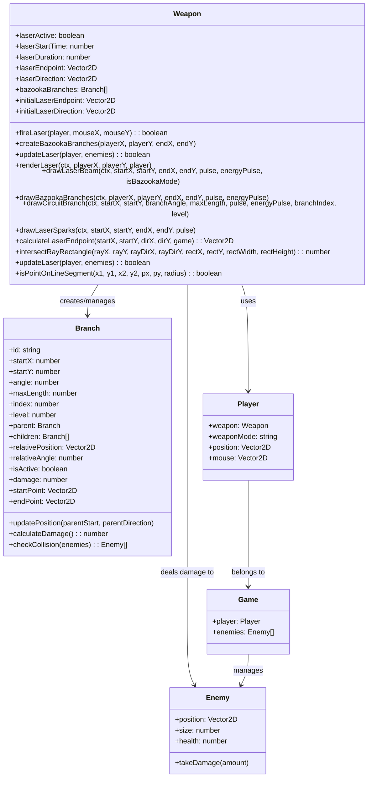

# Enhanced Branching Laser System Design

## Overview

This document outlines the architecture for an enhanced branching laser system that extends the existing bazooka functionality in the game. The system will create a main laser beam with multiple branching lasers that maintain relative positions to their parent throughout the main laser's trajectory.

## Requirements

1. When bazooka is activated, the main laser fires toward the mouse (this already works)
2. 5 branches should grow from the main laser in a relative manner
3. Each branch should have 2 sub-branches
4. All branches should remain in relative positions to their parent throughout the main laser's trajectory
5. Each branch should deal damage independently
6. All branches should follow the main laser's movement while maintaining their initial relative angles and positions

## Class Diagram



## Data Structures

### Branch Structure

```javascript
class Branch {
    constructor(id, startX, startY, angle, maxLength, index, level, parent = null) {
        this.id = id; // Unique identifier for the branch
        this.startX = startX; // X coordinate of branch start point
        this.startY = startY; // Y coordinate of branch start point
        this.angle = angle; // Angle of the branch in radians
        this.maxLength = maxLength; // Maximum length of the branch
        this.index = index; // Index of the branch for identification
        this.level = level; // Level in the hierarchy (1 = main branches, 2 = sub-branches)
        this.parent = parent; // Reference to parent branch (null for main branches)
        this.children = []; // Array of child branches
        
        // Relative positioning data
        this.relativePosition = parent ? 
            new Vector2D(startX - parent.startX, startY - parent.startY) : 
            new Vector2D(0, 0);
        this.relativeAngle = parent ? angle - parent.angle : angle;
        
        // State data
        this.isActive = true; // Whether the branch is active
        this.damage = this.calculateBaseDamage(); // Damage dealt by this branch
        this.startPoint = new Vector2D(startX, startY); // Current start point
        this.endPoint = new Vector2D(0, 0); // Current end point
    }
}
```

### Branch Hierarchy

The branching system will have a hierarchical structure:
- Level 0: Main laser beam (handled by Weapon class)
- Level 1: 5 primary branches extending from the main beam
- Level 2: 2 sub-branches for each primary branch (10 total)

## Algorithms

### 1. Creating the Initial Branch Structure

```javascript
createBazookaBranches(playerX, playerY, endX, endY) {
    // Clear any existing branches
    this.bazookaBranches = [];
    
    // Create 5 primary branches
    for (let i = 0; i < 5; i++) {
        // Calculate position along the main laser beam (20%, 40%, 50%, 60%, 80%)
        const t = 0.2 + (i * 0.15);
        const branchStartX = playerX + (endX - playerX) * t;
        const branchStartY = playerY + (endY - playerY) * t;
        
        // Calculate angle relative to main laser direction
        // Add some variation to make it more interesting
        const mainAngle = Math.atan2(endY - playerY, endX - playerX);
        const branchAngle = mainAngle + (Math.random() - 0.5) * Math.PI / 2; // ±45 degrees
        
        // Create primary branch
        const primaryBranch = new Branch(
            `branch-${i}`, 
            branchStartX, 
            branchStartY, 
            branchAngle, 
            200, // Max length
            i, 
            1 // Level 1
        );
        
        // Create 2 sub-branches for each primary branch
        for (let j = 0; j < 2; j++) {
            // Position sub-branch at 30% and 70% along the primary branch
            const subT = j === 0 ? 0.3 : 0.7;
            const subLength = primaryBranch.maxLength * 0.7; // Sub-branches are shorter
            const subAngle = primaryBranch.angle + (Math.random() - 0.5) * Math.PI / 3; // ±30 degrees
            
            const subBranch = new Branch(
                `sub-branch-${i}-${j}`,
                primaryBranch.startX + Math.cos(primaryBranch.angle) * (primaryBranch.maxLength * subT),
                primaryBranch.startY + Math.sin(primaryBranch.angle) * (primaryBranch.maxLength * subT),
                subAngle,
                subLength,
                j,
                2, // Level 2
                primaryBranch
            );
            
            primaryBranch.children.push(subBranch);
            this.bazookaBranches.push(subBranch);
        }
        
        this.bazookaBranches.push(primaryBranch);
    }
}
```

### 2. Maintaining Relative Positions During Movement

```javascript
updateBranchPositions(playerX, playerY, newEndpoint, newDirection) {
    // Calculate the main laser vector
    const mainVector = new Vector2D(newEndpoint.x - playerX, newEndpoint.y - playerY);
    const mainAngle = Math.atan2(mainVector.y, mainVector.x);
    
    // Update each branch position relative to the main laser
    for (const branch of this.bazookaBranches) {
        if (branch.parent) {
            // For sub-branches, update based on parent position
            branch.updatePosition(branch.parent.startPoint, branch.parent.angle);
        } else {
            // For primary branches, update based on main laser
            // Calculate position along the main laser beam
            const t = this.calculateBranchPositionRatio(branch.index);
            const newStartX = playerX + (newEndpoint.x - playerX) * t;
            const newStartY = playerY + (newEndpoint.y - playerY) * t;
            
            // Update branch angle relative to main laser
            const newAngle = mainAngle + branch.relativeAngle;
            
            branch.startPoint = new Vector2D(newStartX, newStartY);
            branch.angle = newAngle;
        }
        
        // Update children positions
        for (const child of branch.children) {
            child.updatePosition(branch.startPoint, branch.angle);
        }
    }
}

// Helper method to calculate position ratio along main laser
calculateBranchPositionRatio(index) {
    // Distribute branches evenly along the main laser
    return 0.2 + (index * 0.15);
}
```

### 3. Handling Independent Damage Calculation

```javascript
checkBranchCollisions(enemies) {
    const hitEnemies = new Set();
    
    // Check collisions for each branch
    for (const branch of this.bazookaBranches) {
        // Calculate branch end point based on current progress
        const progress = Math.min(1, (Date.now() - this.laserStartTime) / (this.laserDuration * 0.5));
        const currentLength = branch.maxLength * progress;
        branch.endPoint = new Vector2D(
            branch.startPoint.x + Math.cos(branch.angle) * currentLength,
            branch.startPoint.y + Math.sin(branch.angle) * currentLength
        );
        
        // Check collision with each enemy
        for (const enemy of enemies) {
            if (this.isPointOnLineSegment(
                branch.startPoint.x, branch.startPoint.y,
                branch.endPoint.x, branch.endPoint.y,
                enemy.position.x, enemy.position.y,
                enemy.size
            )) {
                // Add enemy to hit set
                hitEnemies.add(enemy);
            }
        }
    }
    
    // Apply damage to all hit enemies
    for (const enemy of hitEnemies) {
        enemy.takeDamage(this.calculateBranchDamage());
    }
    
    return hitEnemies.size > 0;
}

calculateBranchDamage() {
    // Base damage from weapon config
    const baseDamage = this.states.LASER.damage;
    // Branches deal 30% of main laser damage
    return baseDamage * 0.3;
}
```

### 4. Rendering All Branches Correctly

```javascript
drawBazookaBranches(ctx, playerX, playerY, endX, endY, pulse, energyPulse) {
    // Update branch positions to match current laser direction
    this.updateBranchPositions(playerX, playerY, 
        new Vector2D(endX, endY), 
        Math.atan2(endY - playerY, endX - playerX));
    
    // Draw all branches
    for (const branch of this.bazookaBranches) {
        // Draw the branch with a "printed circuit" pattern
        this.drawCircuitBranch(ctx, branch, pulse, energyPulse);
    }
}

drawCircuitBranch(ctx, branch, pulse, energyPulse) {
    // Calculate how much of the branch should be visible based on time
    const now = Date.now();
    const elapsed = now - this.laserStartTime;
    const progress = Math.min(1, elapsed / (this.laserDuration * 0.5)); // Branches grow faster than main laser
    
    // Calculate current length based on progress
    const currentLength = branch.maxLength * progress;
    
    // Calculate endpoint based on angle and current length
    const endX = branch.startPoint.x + Math.cos(branch.angle) * currentLength;
    const endY = branch.startPoint.y + Math.sin(branch.angle) * currentLength;
    
    // Update branch end point
    branch.endPoint = new Vector2D(endX, endY);
    
    // Draw main branch line
    ctx.beginPath();
    ctx.moveTo(branch.startPoint.x, branch.startPoint.y);
    ctx.lineTo(endX, endY);
    
    // Create gradient for branch
    const gradient = ctx.createLinearGradient(branch.startPoint.x, branch.startPoint.y, endX, endY);
    gradient.addColorStop(0, 'rgba(100, 255, 100, 0.8)');  // Bright green start
    gradient.addColorStop(0.5, 'rgba(0, 255, 0, 1)');     // Pure green middle
    gradient.addColorStop(1, 'rgba(0, 150, 0, 0.6)');     // Darker green end
    
    ctx.strokeStyle = gradient;
    ctx.lineWidth = 3 * pulse;
    ctx.stroke();
    
    // Add glow effect
    ctx.shadowColor = '#00ff00';
    ctx.shadowBlur = 15 * pulse;
    ctx.stroke();
    ctx.shadowBlur = 0;
    
    // Draw "printed circuit" elements along the branch
    const segmentLength = 30;
    const segments = Math.floor(currentLength / segmentLength);
    
    for (let i = 1; i < segments; i++) {
        // Position along the branch
        const segmentX = branch.startPoint.x + Math.cos(branch.angle) * (i * segmentLength);
        const segmentY = branch.startPoint.y + Math.sin(branch.angle) * (i * segmentLength);
        
        // Every few segments, draw a circuit element
        if (i % 3 === 0) {
            // Draw a small perpendicular line (like a circuit trace)
            const perpAngle = branch.angle + Math.PI / 2; // 90 degrees perpendicular
            const perpLength = 10 + (branch.index * 2); // Vary length by branch
            
            ctx.beginPath();
            ctx.moveTo(segmentX, segmentY);
            ctx.lineTo(
                segmentX + Math.cos(perpAngle) * perpLength,
                segmentY + Math.sin(perpAngle) * perpLength
            );
            
            ctx.strokeStyle = '#00ff88';
            ctx.lineWidth = 1.5 * pulse;
            ctx.stroke();
            
            // Add a small circle at the end (like a component)
            ctx.beginPath();
            ctx.arc(
                segmentX + Math.cos(perpAngle) * perpLength,
                segmentY + Math.sin(perpAngle) * perpLength,
                3 * pulse,
                0,
                Math.PI * 2
            );
            ctx.fillStyle = '#00ffcc';
            ctx.fill();
        }
        
        // Draw small dots along the branch (like circuit nodes)
        if (i % 2 === 0) {
            ctx.beginPath();
            ctx.arc(segmentX, segmentY, 2 * pulse, 0, Math.PI * 2);
            ctx.fillStyle = '#00ffaa';
            ctx.fill();
        }
    }
    
    // Draw endpoint effect
    ctx.beginPath();
    ctx.arc(endX, endY, 5 * pulse, 0, Math.PI * 2);
    const endpointGradient = ctx.createRadialGradient(
        endX, endY, 0,
        endX, endY, 5 * pulse
    );
    endpointGradient.addColorStop(0, 'rgba(255, 255, 255, 1)');
    endpointGradient.addColorStop(0.5, 'rgba(100, 255, 100, 0.8)');
    endpointGradient.addColorStop(1, 'rgba(0, 255, 0, 0)');
    ctx.fillStyle = endpointGradient;
    ctx.fill();
}
```

## Integration Points

### 1. Weapon Class Modifications

The `Weapon` class will need the following modifications:
- Enhanced `bazookaBranches` array to store the hierarchical branch structure
- Updated `createBazookaBranches` method to create the new branch hierarchy
- Modified `updateLaser` method to handle branch collision detection
- Enhanced `renderLaser` method to render all branches correctly
- New helper methods for branch position updates and damage calculations

### 2. Player Class Integration

The `Player` class already has the `weaponMode` property that can be used to activate the branching laser system. No major modifications are needed.

### 3. Game Class Integration

The `Game` class will need to pass the enemies array to the weapon's `updateLaser` method for collision detection.

## Performance Considerations

1. **Spatial Partitioning**: Use spatial grid optimization for collision detection to avoid checking all enemies for each branch.

2. **Branch Culling**: Only render and update branches that are within the camera view or near the player.

3. **Object Pooling**: Reuse branch objects instead of creating/destroying them each time the laser is fired.

4. **Damage Calculation Optimization**: Use a set to track hit enemies to avoid applying damage multiple times to the same enemy.

5. **Rendering Optimization**: Limit the number of visual effects (particles, sparks) to maintain performance.

## Configuration Options

### 1. Branch Configuration

```javascript
const BRANCH_CONFIG = {
    PRIMARY_COUNT: 5,           // Number of primary branches
    SUB_BRANCH_COUNT: 2,        // Number of sub-branches per primary branch
    PRIMARY_LENGTH: 200,        // Maximum length of primary branches
    SUB_LENGTH: 140,            // Maximum length of sub-branches (70% of primary)
    DAMAGE_MULTIPLIER: 0.3,     // Branch damage as percentage of main laser
    GROWTH_SPEED: 2.0           // How fast branches grow (relative to main laser)
};
```

### 2. Visual Configuration

```javascript
const VISUAL_CONFIG = {
    MAIN_COLOR: '#00ff00',      // Main branch color
    SUB_COLOR: '#00cc66',       // Sub-branch color
    GLOW_COLOR: '#00ff00',      // Glow color
    GLOW_INTENSITY: 15,         // Glow intensity
    CIRCUIT_ELEMENTS: true,     // Whether to show circuit elements
    SPARKS: true,               // Whether to show sparks
    SPARK_DENSITY: 0.3          // Density of sparks (0.0 to 1.0)
};
```

## Potential Challenges and Edge Cases

1. **Collision Detection Performance**: With up to 15 branches, collision detection could become a performance bottleneck. Using spatial partitioning will help mitigate this.

2. **Branch Positioning at Boundaries**: When the main laser hits a boundary, branches might extend outside the play area. Need to clamp branch endpoints to valid positions.

3. **Visual Clutter**: With many branches, the screen could become visually cluttered. Consider fading out branches that are far from the player or at the edge of the screen.

4. **Damage Balance**: Ensuring that the branching laser is balanced compared to other weapons. The damage multiplier and fire rate will need careful tuning.

5. **Synchronization Issues**: Ensuring that all branches update and render in sync with the main laser, especially when the player moves the mouse rapidly.

6. **Memory Management**: Properly cleaning up branch objects when the laser deactivates to prevent memory leaks.

## Implementation Plan

1. **Phase 1**: Implement the basic branch structure and rendering
   - Create the Branch class
   - Modify the Weapon class to create and manage branches
   - Implement the rendering system for branches

2. **Phase 2**: Implement position maintenance and movement
   - Add relative positioning calculations
   - Implement branch position updates when the main laser moves
   - Test branch behavior with mouse movement

3. **Phase 3**: Implement damage system
   - Add collision detection for branches
   - Implement independent damage calculation
   - Integrate with enemy damage system

4. **Phase 4**: Optimization and polishing
   - Add performance optimizations
   - Fine-tune visual effects
   - Balance damage and other parameters
   - Test edge cases and fix issues

5. **Phase 5**: Configuration and customization
   - Add configuration options
   - Implement different visual styles
   - Add customization features

This design provides a comprehensive architecture for the enhanced branching laser system that meets all the specified requirements while considering performance and maintainability.