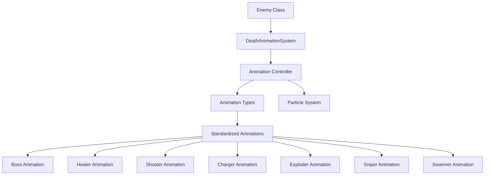

# Unified Death Animation System - Technical Specification

## 1. Overview

This document outlines the design and implementation of a unified death animation system for all enemies in the THETUMB video game. The system addresses inconsistencies in the current implementations while maintaining the unique visual identity of each enemy type.

## 2. Current Issues

### 2.1 Inconsistent Animation Speeds
- Boss: 0.02 (slowest)
- Healer: 0.08
- Shooter: 0.1
- Charger: 0.08
- Exploder: 0.15 (fastest)
- Sniper: 0.05
- Swarmer: 0.1

### 2.2 Different Visual Effects
Each enemy type has its own unique death animation effects:
- Boss: Complex effects with multiple explosions, dissolve, energy drain, debris, shockwave, screen shake, and flash
- Healer: Dissolve effect with healing energy dispersal
- Shooter: Glitch effect with scanlines
- Charger: Explosion animation with rings and debris
- Exploder: Massive explosion animation with multiple rings and fire particles
- Sniper: Scope shatter effect
- Swarmer: Simple dissolve animation

### 2.3 Premature Enemy Removal
Enemies are removed from the game immediately when health reaches 0, which can cause death animations to be cut short.

### 2.4 Integration Issues
Death animations are integrated within each enemy's render method, making maintenance difficult.

## 3. Requirements

### 3.1 Functional Requirements
1. Standardize animation speeds across all enemy types
2. Maintain unique visual identity for each enemy type
3. Ensure death animations complete before enemies are removed
4. Provide a clean interface for enemy classes to use
5. Integrate with existing particle system
6. Support different animation types while preserving unique effects

### 3.2 Non-Functional Requirements
1. Performance: Animation system should not significantly impact frame rate
2. Maintainability: System should be easy to modify and extend
3. Compatibility: System should work with existing enemy classes with minimal changes
4. Scalability: System should support new enemy types easily

## 4. System Design

### 4.1 Architecture Overview



### 4.2 DeathAnimationSystem Class

The `DeathAnimationSystem` class will be responsible for managing all death animations:

```javascript
class DeathAnimationSystem {
    constructor() {
        this.animations = [];
        this.defaultAnimationSpeed = 0.08; // Standardized speed
    }
    
    // Initialize death animation for an enemy
    startAnimation(enemy, enemyType) {
        const animation = {
            enemy: enemy,
            type: enemyType,
            progress: 0,
            speed: enemy.deathAnimationSpeed || this.defaultAnimationSpeed,
            isComplete: false,
            startTime: Date.now()
        };
        
        this.animations.push(animation);
        return animation;
    }
    
    // Update all active animations
    update() {
        for (let i = this.animations.length - 1; i >= 0; i--) {
            const animation = this.animations[i];
            animation.progress += animation.speed;
            
            if (animation.progress >= 1.0) {
                animation.isComplete = true;
                this.animations.splice(i, 1);
            }
        }
    }
    
    // Check if an enemy's death animation is complete
    isAnimationComplete(enemy) {
        return this.animations.some(anim => anim.enemy === enemy && anim.isComplete);
    }
    
    // Check if an enemy is currently dying
    isDying(enemy) {
        return this.animations.some(anim => anim.enemy === enemy);
    }
    
    // Get animation progress for an enemy
    getAnimationProgress(enemy) {
        const animation = this.animations.find(anim => anim.enemy === enemy);
        return animation ? animation.progress : 0;
    }
}
```

### 4.3 Standardized Animation Types

Each enemy type will have its own animation renderer while using the standardized progress tracking:

1. **Boss Animation**
   - Multiple explosions with staggered timing
   - Dissolve effect with large particles
   - Energy drain with multiple sources
   - Debris with physics
   - Shockwave effects
   - Screen shake and flash effects

2. **Healer Animation**
   - Dissolve effect with healing energy dispersal
   - Energy particles moving outward
   - Screen shake effect

3. **Shooter Animation**
   - Glitch effect with scanlines
   - Digital distortion effects
   - Particle dispersal

4. **Charger Animation**
   - Explosion rings expanding outward
   - Debris particles
   - Shockwave effects

5. **Exploder Animation**
   - Multiple explosion rings
   - Fire particles
   - Shockwave effects
   - Screen shake

6. **Sniper Animation**
   - Scope shatter effect
   - Glass shard particles
   - Precision effects

7. **Swarmer Animation**
   - Simple dissolve animation
   - Basic particle effects
   - Minimal screen effects

## 5. Integration with Existing Systems

### 5.1 Particle System Integration
The death animation system will leverage the existing `ParticleSystem` class for all particle effects:
- `addExplosion()`
- `addDissolveEffect()`
- `addEnergyDrain()`
- `addDebris()`
- `createShockwave()`
- `addScreenShake()`
- `addFlash()`

### 5.2 Game Loop Integration
The death animation system will be integrated into the main game loop:

```javascript
class Game {
    constructor() {
        // ... existing code ...
        this.deathAnimationSystem = new DeathAnimationSystem();
    }
    
    update() {
        // ... existing code ...
        
        // Update death animations
        this.deathAnimationSystem.update();
        
        // Update enemies (modified to not remove dying enemies)
        this.enemies = this.enemies.filter(enemy => {
            // ... existing update logic ...
            
            // Remove enemy only if death animation is complete
            if (enemy.health <= 0) {
                return !this.deathAnimationSystem.isAnimationComplete(enemy);
            }
            return true;
        });
    }
    
    render() {
        // ... existing code ...
        
        // Render enemies (modified to handle death animations)
        this.enemies.forEach(enemy => {
            if (this.deathAnimationSystem.isDying(enemy)) {
                // Render death animation
                this.renderDeathAnimation(enemy);
            } else {
                // Render normal enemy
                enemy.render(this.ctx);
            }
        });
    }
}
```

## 6. Enemy Class Modifications

### 6.1 Base Enemy Class
The base `Enemy` class will be modified to include death animation support:

```javascript
class Enemy {
    constructor(x, y) {
        // ... existing properties ...
        this.isDying = false;
        this.deathAnimationSpeed = 0.08; // Standardized speed
    }
    
    takeDamage(amount) {
        this.health = Math.max(0, this.health - amount);
        
        if (this.health <= 0 && !this.isDying) {
            this.isDying = true;
            // Trigger death animation through the system
            if (window.game && window.game.deathAnimationSystem) {
                window.game.deathAnimationSystem.startAnimation(this, this.constructor.name);
            }
            
            // Trigger particle effects
            this.triggerDeathEffects();
        }
    }
    
    triggerDeathEffects() {
        // Base implementation - can be overridden by specific enemy types
        if (window.game && window.game.particleSystem) {
            window.game.particleSystem.addExplosion(
                this.position.x,
                this.position.y,
                this.color,
                10,
                1
            );
        }
    }
}
```

### 6.2 Specific Enemy Modifications
Each enemy class will override the `triggerDeathEffects()` method to create their unique visual effects while using the standardized animation system.

## 7. Implementation Plan

### 7.1 Phase 1: System Development
1. Create `DeathAnimationSystem` class
2. Implement standardized animation tracking
3. Integrate with existing particle system
4. Create animation renderers for each enemy type

### 7.2 Phase 2: Integration
1. Modify base `Enemy` class
2. Update `Game` class to use death animation system
3. Modify enemy classes to use new system
4. Test with all enemy types

### 7.3 Phase 3: Optimization and Polish
1. Performance optimization
2. Visual polish and refinement
3. Bug fixing and testing
4. Documentation

## 8. Benefits

1. **Consistency**: Standardized animation speeds and completion tracking
2. **Maintainability**: Centralized death animation management
3. **Performance**: Proper completion tracking prevents premature removal
4. **Extensibility**: Easy to add new enemy types or animation styles
5. **Visual Identity**: Preserves unique effects for each enemy type
6. **Integration**: Works seamlessly with existing particle system

## 9. Testing Plan

1. Unit tests for `DeathAnimationSystem` class
2. Integration tests with each enemy type
3. Performance tests to ensure frame rate stability
4. Visual verification of all death animations
5. Edge case testing (rapid enemy deaths, simultaneous deaths, etc.)

## 10. Future Enhancements

1. Animation blending for smoother transitions
2. Configurable animation speeds through game settings
3. Additional animation types for new enemy variants
4. Sound effect integration with animations
5. Screen effect enhancements (chromatic aberration, etc.)